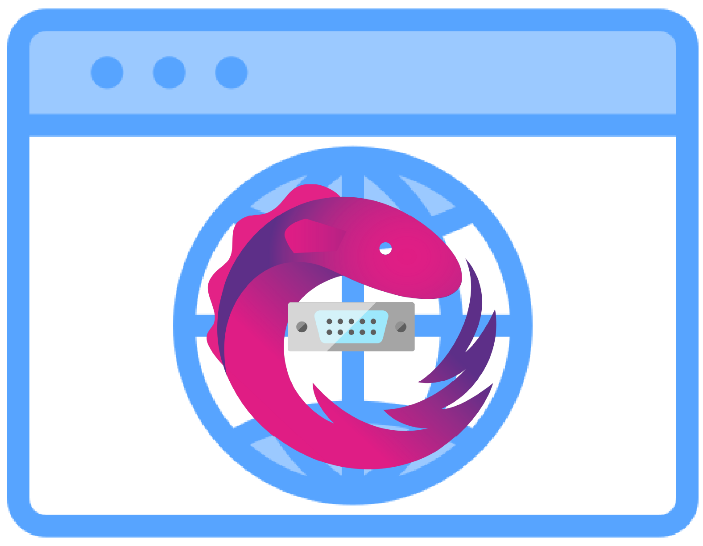

# web-serial-rxjs

<p align="center">
  
</p>

Web Serial API を最小限の Session 指向 RxJS API でラップする TypeScript ライブラリです。公開 API は単一の `SerialSession` を提供し、アプリケーション側は `state$`（canonical lifecycle state）/ `errors$`（error event channel）/ `receive$` / `lines$` を購読するだけで UI を駆動できます。BehaviorSubject による状態再構築・read loop・送信キューの自前実装は一切不要です。

## 目次

- [SerialSession の全体像](#serialsessionの全体像)
- [機能](#機能)
- [対応フレームワーク](#対応フレームワーク)
- [ブラウザサポート](#ブラウザサポート)
- [インストール](#インストール)
- [ドキュメント](#ドキュメント)
- [サンプル](#サンプル)
- [プロジェクトアイコンについて](#プロジェクトアイコンについて)
- [AI アシスタント（MCP）](#ai-アシスタントmcp)
- [貢献](#貢献)
- [ライセンス](#ライセンス)
- [リンク](#リンク)

## 機能

- **Session 指向のリアクティブ API**: 1 つの `SerialSession` が `state$`（canonical lifecycle discriminated union）/ `errors$`（error event channel）/ `receive$` / `lines$` と convenience stream の `isConnected$`、`connect$` / `disconnect$` / `send$` を公開
- **UTF-8 テキストストリーム**: `receive$` は内部でストリーミング `TextDecoder` を用いてデコード済み。マルチバイト文字がチャンクにまたがっても正しく結合されます
- **順序保証された送信キュー**: 並行する `send$` 呼び出しも内部キューで FIFO 処理され、呼び出し順に書き込まれます
- **統一エラーチャネル**: すべての I/O エラーは `SerialError` に正規化され `errors$` に多重化されます
- **明示的なライフサイクル**: `state$` は `status` を持つ discriminated union（`idle` / `connecting` / `connected` / `disconnecting` / `unsupported` / `error` / `disposed`）を emit するので、`state.status` で narrowing し `state.portInfo` などにアクセスできます
- **TypeScript サポート**: 完全な TypeScript 型定義を同梱
- **フレームワーク非依存**: 任意の JavaScript/TypeScript フレームワークまたはバニラ JavaScript で利用可能

## 対応フレームワーク

このライブラリはフレームワーク非依存で、以下の環境で利用できます。

- Angular
- React
- Svelte
- Vanilla JavaScript / TypeScript

## ブラウザサポート

Web Serial API は**デスクトップ**ブラウザでのみサポートされています。スマートフォンなどのモバイルブラウザには対応していません。

対応しているデスクトップブラウザ：

- **Chrome** 89+
- **Edge** 89+
- **Opera** 75+
- **Firefox** 151+

**Safari** は現時点で Web Serial API をサポートしていません。

`connect$` を呼ぶ前の feature detection には `SerialSession.isBrowserSupported()` が使えます（同期的に `boolean` を返します）。

## インストール

npm または pnpm を使用してパッケージをインストールします：

```bash
npm install @gurezo/web-serial-rxjs
# または
pnpm add @gurezo/web-serial-rxjs
```

### ピア依存関係

このライブラリは RxJS をピア依存関係として必要とします：

```bash
npm install rxjs
# または
pnpm add rxjs
```

**最小要件バージョン**: RxJS ^7.8.0

## SerialSession の全体像

機能一覧と **`SerialSession` 早見表**、**`SerialSessionState` 表**、**最小サンプル**の正本は次のパッケージドキュメントにあります。

- **[SerialSession の概要](packages/web-serial-rxjs/docs/OVERVIEW.ja.md)**（[English](packages/web-serial-rxjs/docs/OVERVIEW.md)）

npm の [`@gurezo/web-serial-rxjs` README](packages/web-serial-rxjs/README.ja.md) は短い目次に留め、初回接続の手順は [クイックスタート](packages/web-serial-rxjs/docs/QUICK_START.ja.md) を参照してください。

**`receive$`** と **`lines$`** をいつ使うか（ターミナル表示・バッファと、改行区切りログ・解析の違い）は [パッケージ README](packages/web-serial-rxjs/README.ja.md) の「`receive$` と `lines$`」にまとめています。

## ドキュメント

ドキュメントは **Guide**（使い方。日本語・英語の手書き Markdown）と **API Reference**（英語 TypeDoc。TypeScript JSDoc から生成）に分離します。canonical な構成は [ドキュメント構成](packages/web-serial-rxjs/docs/ARCHITECTURE.ja.md)（[English](packages/web-serial-rxjs/docs/ARCHITECTURE.md)）に定義しています。Guide は今後 `packages/web-serial-rxjs/docs/guide/{ja,en}/` へ移行します。移行完了までは下記リンクは現行パスを指します。

| ドキュメント | 用途 |
| --- | --- |
| **この README** | モノレポのハブ：機能要約、サンプル、貢献導線。 |
| **[SerialSession の概要](packages/web-serial-rxjs/docs/OVERVIEW.ja.md)** | 公開面・`SerialSessionState` 早見、最小サンプル。 |
| **[クイックスタート](packages/web-serial-rxjs/docs/QUICK_START.ja.md)** | 最短でポートを開いて購読するところまで。 |
| **[高度な使用方法](packages/web-serial-rxjs/docs/ADVANCED_USAGE.ja.md)** | 行フレーミング、擬似リクエスト／レスポンス、リカバリ。 |
| **[API リファレンス](packages/web-serial-rxjs/docs/API_REFERENCE.ja.md)** | オプション、`SerialSessionState`、`SerialError` の詳細。 |
| **[v2 → v3 マイグレーション](packages/web-serial-rxjs/docs/MIGRATION_V3.ja.md)** | `state$` discriminated union、`SerialSessionStatus`、`context.cause`。 |
| **[v1 → v2 マイグレーション](packages/web-serial-rxjs/docs/MIGRATION_V2.ja.md)** | 削除された v1 API からの対応表。 |

## サンプル

以下の環境向けのサンプルを用意しています。

- **[Angular](apps/example-angular/)** - Service を使用した Angular の例
- **[React](apps/example-react/)** - カスタムフック（`useSerialSession`）を使用した React の例
- **[Svelte](apps/example-svelte/)** - Svelte Store を使用した Svelte の例
- **[Vanilla JavaScript](apps/example-vanilla-js/)** - バニラ JavaScript での基本的な使用方法
- **[Vanilla TypeScript](apps/example-vanilla-ts/)** - RxJS を使用した TypeScript の例
- **[Vue](apps/example-vue/)** - Composition API を使用した Vue 3 の例

各サンプルは **connect・受信（ターミナル表示は `\r` を保持するため `receive$` で連結）・send・disconnect** の最小動作確認用です。**`lines$`** は改行区切りログや解析向けであり、対話的シェル出力のミラーには **`receive$`** を使ってください。行フレーミングや応用パターンの詳細は [高度な使用方法](https://github.com/gurezo/web-serial-rxjs/blob/main/packages/web-serial-rxjs/docs/ADVANCED_USAGE.ja.md) に集約しています。

各例には、セットアップと使用方法の説明を含む README が含まれています。

## プロジェクトアイコンについて

このプロジェクトのアイコンには、[RxJS](https://rxjs.dev/) のロゴから着想を得たデザインに、
Web Serial を表すシリアルコネクタのモチーフを組み合わせたものを使用しています。

このアイコンは、本ライブラリが Web Serial API を RxJS ベースで扱うための
ライブラリであることを示す目的でのみ使用しています。

本プロジェクトは **[ReactiveX](http://reactivex.io/) / [RxJS](https://rxjs.dev/) 公式とは関係のない独立したオープンソースプロジェクト** であり、
公式な提携・承認・スポンサー関係はありません。

## AI アシスタント（MCP）

このプロジェクトには、AI 支援開発向けの [Model Context Protocol (MCP)](https://modelcontextprotocol.io/) サーバー設定が含まれています。利用可能な MCP サーバーは次のとおりです。

| サーバー | 用途 |
| -------- | ---- |
| **nx-mcp** | Nx ワークスペース分析、プロジェクトグラフ、CI 監視、ドキュメント |
| **angular-cli** | example-angular 向け Angular CLI ツール（コード生成、ドキュメント、ベストプラクティス） |
| **svelte** | example-svelte 向け Svelte / SvelteKit ドキュメントとコード分析 |

**設定ファイル:**

- `.mcp.json` — 標準 MCP 設定（Cursor、VS Code、Claude など）
- `.cursor/mcp.json` — Cursor 専用設定

Cursor では `.cursor/mcp.json` から設定が自動的に読み込まれます。VS Code では MCP 拡張機能を追加し `.mcp.json` を使うか、MCP 設定にサーバー定義を追加してください。

### Cursor rules と agents

このリポジトリには `.cursor/rules/` 配下に [Cursor](https://www.cursor.com/) 用ルールも同梱されています（トピック別: Conventional Commits と PR タイトル用の `commits/`、`typescript/`、`rxjs/`、`angular/`、Nx ワークスペースタスクと **commit scope** ガイドを含む `nx/`、`examples/`、`workflow/`）。ルールは責務ごとに小さな `.mdc` ファイルへ分割し、重複を減らしてプロンプトを絞り込んでいます。

- `.cursor/agents/ci-monitor-subagent.md` — Nx Cloud CI 監視が有効な場合に `/monitor-ci` および Nx MCP の `ci_information` / `update_self_healing_fix` ツールと併用する任意の CI ヘルパー

commit scope の表は `commitlint.config.js` と整合します。例と scope 一覧は `.cursor/skills/conventional-commits/` を参照してください。

## 開発とリリース戦略

このプロジェクトは**trunk-based開発**アプローチに従います：

- **`main`ブランチ**: 常にリリース可能な状態
- **短命ブランチ**: `feature/*`, `fix/*`, `docs/*` はプルリクエスト用
- **リリース**: ブランチではなくGitタグ（例: `v1.0.0`）で管理
- **バージョン保守**: 複数のメジャーバージョンを保守する必要がある場合のみ `release/v*` ブランチを追加

詳細な貢献ガイドラインについては、[CONTRIBUTING.ja.md](CONTRIBUTING.ja.md) を参照してください。

詳細なリリース手順については、[RELEASING.ja.md](RELEASING.ja.md) を参照してください。

## 貢献

貢献を歓迎します！詳細については、[貢献ガイド](CONTRIBUTING.ja.md)を参照してください：

- 開発環境のセットアップ
- コードスタイルガイドライン
- コミットメッセージの規約
- プルリクエストのプロセス
- リリースプロセス

英語版の貢献ガイドは [CONTRIBUTING.md](CONTRIBUTING.md) を参照してください。

リリース手順については、[RELEASING.ja.md](RELEASING.ja.md)（または英語版は [RELEASING.md](RELEASING.md)）を参照してください。

## ライセンス

このプロジェクトは MIT ライセンスの下で公開されています。詳細は [LICENSE](LICENSE) ファイルを参照してください。

## リンク

- **GitHub リポジトリ**: [https://github.com/gurezo/web-serial-rxjs](https://github.com/gurezo/web-serial-rxjs)
- **イシュー**: [https://github.com/gurezo/web-serial-rxjs/issues](https://github.com/gurezo/web-serial-rxjs/issues)
- **Web Serial API 仕様**: [https://wicg.github.io/serial/](https://wicg.github.io/serial/)
