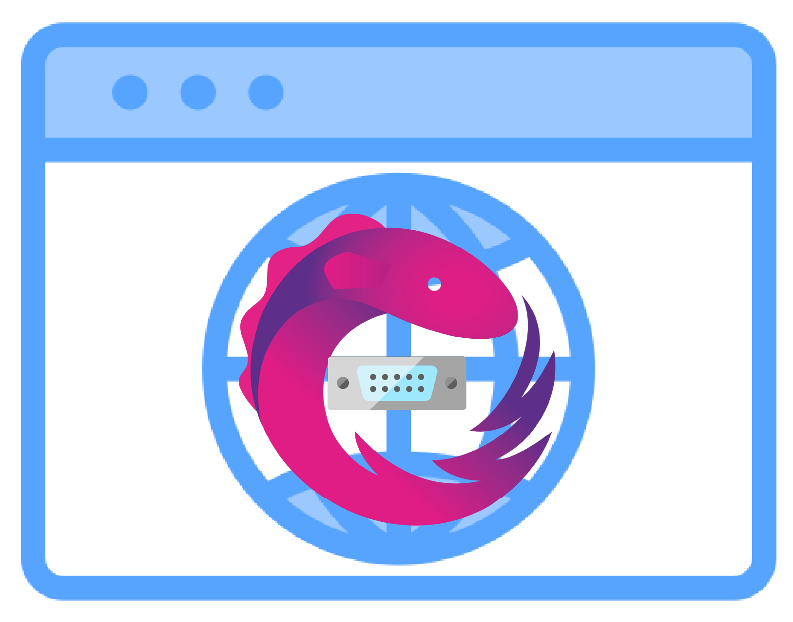

# @gurezo/web-serial-rxjs

<p align="center">
  
</p>

Web Serial API を最小限の Session 指向 RxJS 表面でラップする TypeScript ライブラリです。v2 では単一の `SerialSession` を公開し、`state$` / `isConnected$` / `receive$` / `lines$` / `errors$` を購読するだけで UI を駆動できます。read loop や送信キューの自前実装は不要です。

## ブラウザサポート

Web Serial API は **Chromium 系**のブラウザ（**Chrome** 89+、**Edge** 89+、**Opera** 75+）でのみ利用できます。

`connect$` の前の feature detection には `SerialSession.isBrowserSupported()`（同期的に `boolean`）を使います。

## インストール

```bash
npm install @gurezo/web-serial-rxjs
# または
pnpm add @gurezo/web-serial-rxjs
```

### ピア依存関係

**RxJS** `^7.8.0` をピア依存関係として必要とします。

```bash
npm install rxjs
# または
pnpm add rxjs
```

## 次に読むもの

- **v2 の全体像**（機能一覧、`SerialSession` 早見表、`SerialSessionState`、最小サンプル）: [SerialSession（v2）の概要](https://github.com/gurezo/web-serial-rxjs/blob/main/packages/web-serial-rxjs/docs/OVERVIEW.ja.md)（[English](https://github.com/gurezo/web-serial-rxjs/blob/main/packages/web-serial-rxjs/docs/OVERVIEW.md)）
- 最短でポートを開く手順: [クイックスタート](https://github.com/gurezo/web-serial-rxjs/blob/main/packages/web-serial-rxjs/docs/QUICK_START.ja.md)

## ドキュメント

| ドキュメント | 用途 |
| --- | --- |
| [全体像](https://github.com/gurezo/web-serial-rxjs/blob/main/packages/web-serial-rxjs/docs/OVERVIEW.ja.md) | 機能と v2 `SerialSession` / `SerialSessionState` の対応表 |
| [クイックスタート](https://github.com/gurezo/web-serial-rxjs/blob/main/packages/web-serial-rxjs/docs/QUICK_START.ja.md) | ポートを開いて購読までを最短で |
| [高度な使用方法](https://github.com/gurezo/web-serial-rxjs/blob/main/packages/web-serial-rxjs/docs/ADVANCED_USAGE.ja.md) | 行フレーミング、擬似リクエスト/レス、リカバリ |
| [API リファレンス](https://github.com/gurezo/web-serial-rxjs/blob/main/packages/web-serial-rxjs/docs/API_REFERENCE.ja.md) | オプション、`SerialError`、型の詳細 |
| [v1 → v2 マイグレーション](https://github.com/gurezo/web-serial-rxjs/blob/main/packages/web-serial-rxjs/docs/MIGRATION_V2.ja.md) | 廃止された v1 API の置き換え |
| **リポジトリ [README](https://github.com/gurezo/web-serial-rxjs/blob/main/README.ja.md)** | モノレポ構成、**`apps/` のサンプル**、貢献、MCP、プロジェクトアイコン |

## ライセンス

MIT。詳細はリポジトリの [LICENSE](https://github.com/gurezo/web-serial-rxjs/blob/main/LICENSE) を参照してください。

## リンク

- **リポジトリ**: [github.com/gurezo/web-serial-rxjs](https://github.com/gurezo/web-serial-rxjs)
- **イシュー**: [github.com/gurezo/web-serial-rxjs/issues](https://github.com/gurezo/web-serial-rxjs/issues)
- **Web Serial API 仕様**: [wicg.github.io/serial](https://wicg.github.io/serial/)
