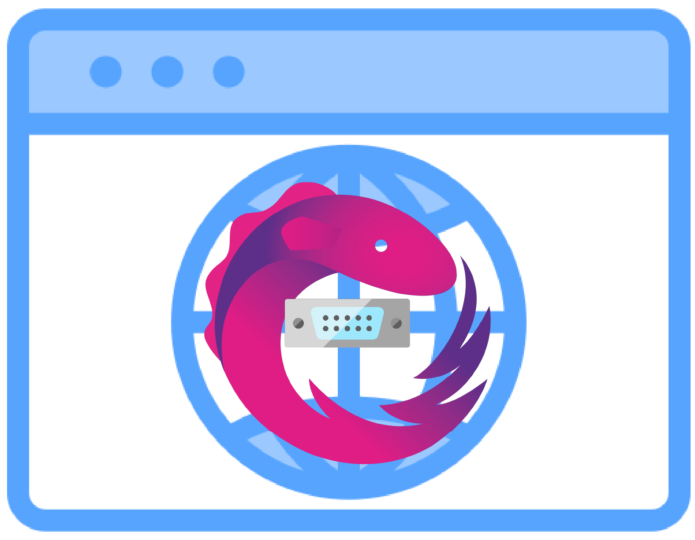

# SerialSession overview

<p align="center">
  
</p>

This page is the **mental model** for the public API: what each `SerialSession` surface does, how `SerialSessionState` maps to `state$`, and how to choose among `receive$`, `lines$`, and `terminalText$` (see [stream selection](./stream-selection.md)). **`state$`** is the canonical lifecycle source; **`errors$`** is the canonical error event channel. For options, error codes, and formal type details, see [API Reference (TypeDoc)](modules.html).

## Table of Contents

- [Documentation](#documentation)
- [Features](#features)
- [Framework support](#framework-support)
- [SerialSession at a glance](#serialsession-at-a-glance)
- [Documentation index](#documentation-index)

## Documentation

Start here:

- [Quick Start](./quick-start.md)
- [Advanced Usage](./advanced-usage.md)
- [API concepts and design notes](./concepts.md)
- [Troubleshooting](./troubleshooting.md)
- [v2 to v3 Migration Guide](./migration-v3.md)
- [v1 to v2 Migration Guide](./migration-v2.md)

Standalone guides (HTML):

- [English Guide](../guide/en/README.md)
- [日本語 Guide](../guide/ja/README.md)
- [Documentation home](../index.html)

## Features

- **Session-oriented reactive API**: a single `SerialSession` exposes `state$` (canonical lifecycle discriminated union), `errors$` (error event channel), `receive$`, `lines$`, and `connect$`, `disconnect$`, `dispose$`, and `send$`
- **UTF-8 text stream**: `receive$` is already decoded with a streaming `TextDecoder`, so multi-byte characters split across chunks are joined correctly
- **Ordered send queue**: concurrent `send$` calls are serialized internally in call order, without the caller having to manage a writer
- **Unified error channel**: every I/O error is normalised into `SerialError` and multiplexed on `errors$`
- **Explicit lifecycle**: `state$` emits a discriminated union with `status` (`idle` / `connecting` / `connected` / `disconnecting` / `unsupported` / `error` / `disposed`) so UIs can narrow on `state.status` and access per-state data
- **TypeScript support**: full TypeScript type definitions included
- **Framework agnostic**: works with any JavaScript/TypeScript framework or vanilla JavaScript

## Framework support

This library is framework-agnostic and can be used with:

- Angular
- React
- Svelte
- Vanilla JavaScript / TypeScript

## SerialSession at a glance

`createSerialSession` returns a single **SerialSession**. All interaction goes through the fields below. The public API is intentionally small; **`receive$`** is for **unframed UTF-8 decoder chunks** (including terminals and `\r` redraws — not wire bytes), **`lines$`** for **newline-delimited logs and parsers**. When you need **custom** framing, compose plain RxJS on `receive$` (see [Advanced Usage](./advanced-usage.md)). Data scope: [Supported data](./concepts.md#supported-data-text--binary--charset).

| Surface | Role |
| --- | --- |
| `state$` | **Canonical connection lifecycle** — discriminated union (`status` plus optional `portInfo` / `error`). Replays on subscribe. Compare **`state.status`** with **`SerialSessionStatus`**. |
| `SerialSessionStatus` | **Status constants** — const object (e.g. `SerialSessionStatus.Connected` → `'connected'`). Compare with `state$.status`. |
| `SerialSessionState` | **Payload type** for `state$` (discriminated union). |
| `receive$` | **Decoded text chunks** — UTF-8 text as emitted by the pump (not line-aligned; multi-byte safe; **not** wire bytes). Preserves `\r` and other control characters. Use for **terminal-like mirrors** and progress output that relies on carriage-return redraws. |
| `terminalText$` | **Terminal-ready cumulative text** — display-oriented text derived from `receive$` that folds carriage-return redraws while keeping normal newline behavior. By default strips ANSI escape sequences for plain-text UIs; use `receive$` for raw output. Use when you want to bind one string directly to a terminal-like viewport. By default retains at most 10,000 lines and 1,048,576 characters (configure via `SerialSessionOptions.terminalBuffer`). |
| `lines$` | **Line-delimited UTF-8 text** — one string per complete line via the built-in buffer (`\n`, `\r\n`, interior `\r`). Use for **logs** and **line-by-line parsing**, not for mirroring unframed terminal streams where `\r` must stay intact. |
| `errors$` | **Canonical error event channel** — all `SerialError` instances from connect / read / write / close (fatal and non-fatal). |
| `connect$()` | **Open** a user-selected port and start the internal read pump. |
| `disconnect$()` | **Close** the port and stop the pump. The session stays reusable (`idle`). |
| `dispose$()` | **Permanently tear down** the session: close any active connection, complete all observables, and prevent reuse. |
| `send$(string \| Uint8Array)` | **Enqueue** outgoing data; writes are **FIFO-ordered** when multiple `send$` run concurrently. |

**Top-level (not a `SerialSession` member):** `isWebSerialSupported()` — synchronous `boolean` for Web Serial availability before creating a session or calling `connect$`.

### SerialSessionStatus (quick reference)

Each `state$` emission has a `status` field. Prefer the **const object** (e.g. `SerialSessionStatus.Connected` → `'connected'`).

| Constant | Value | Meaning |
| --- | --- | --- |
| `SerialSessionStatus.Idle` | `'idle'` | No open port; initial when Web Serial is supported. |
| `SerialSessionStatus.Connecting` | `'connecting'` | `connect$` in progress. |
| `SerialSessionStatus.Connected` | `'connected'` | Port open; read pump running (`portInfo` included). |
| `SerialSessionStatus.Disconnecting` | `'disconnecting'` | `disconnect$` in progress. |
| `SerialSessionStatus.Unsupported` | `'unsupported'` | Web Serial unavailable at session creation. |
| `SerialSessionStatus.Error` | `'error'` | Fatal failure (`error` included). |
| `SerialSessionStatus.Disposed` | `'disposed'` | Session permanently torn down via `dispose$`. |

**`receive$` / `lines$` / `terminalText$`:** pick by use case — newline logs and parsers → **`lines$`**; unframed decoder chunks and custom framing → **`receive$`**; terminal-style UI binding → **`terminalText$`**. Full decision table: [Choosing receive$ / lines$ / terminalText$](./stream-selection.md). Supported data scope: [Supported data](./concepts.md#supported-data-text--binary--charset).

**Connected boolean for UI** — when you only need a flag, derive it from `state$` (see [Advanced Usage](./advanced-usage.md#connected-boolean-ui-narrowing)) or narrow on `state.status === SerialSessionStatus.Connected`. Removed convenience APIs are documented in [Migrating to v4 – Phase 1 API removals](./migration-v4.md#phase-1-api-removals).

### Minimal example

```typescript
import {
  createSerialSession,
  isConnectedSessionState,
  isWebSerialSupported,
} from '@gurezo/web-serial-rxjs';
import { filter } from 'rxjs';

const session = createSerialSession({ baudRate: 115200 });

if (!isWebSerialSupported()) {
  throw new Error('Web Serial is not available in this browser');
}

session.lines$.subscribe(console.log);
session.errors$.subscribe(console.error);
session.state$
  .pipe(filter(isConnectedSessionState))
  .subscribe((state) => {
    console.log(state.portInfo);
  });
session.connect$().subscribe();
session.send$('hello\r\n').subscribe();
```

In real apps, handle `connect$().subscribe({ next, error })` and `send$().subscribe({ error })` (errors are also on `errors$`). A fuller walkthrough is in [Quick Start](./quick-start.md).

## Documentation index

| Doc | Use it for |
| --- | --- |
| **[English Guide index](./README.md)** | Getting Started reading order and full index. |
| **[日本語 Guide 索引](../ja/README.md)** | Getting Started の読み順と一覧。 |
| **Repository [README](https://github.com/gurezo/web-serial-rxjs/blob/main/README.md)** | Monorepo overview, examples index, and contribution links. |
| **[Quick Start](./quick-start.md)** | Shortest path to a working open port and subscriptions. |
| **[Choosing receive$ / lines$ / terminalText$](./stream-selection.md)** | Pick the receive stream by use case. |
| **[Communication pattern Recipes](./recipes.md)** | Pattern → Guide / Recipe index (not device compatibility). |
| **[Advanced Usage](./advanced-usage.md)** | Line framing, derived streams, and recovery. |
| **[Request / Response](./request-response.md)** | Command + matching reply on `lines$` / `receive$`. |
| **[Timeout / cancel / retry](./timeout-cancel-retry.md)** | Timeouts, teardown cancel, bounded retry. |
| **[Hardware-free testing](./testing.md)** | Controllable Fake `SerialSession` without a port. |
| **[Troubleshooting](./troubleshooting.md)** | Common Web Serial / session problems and self-help checks. |
| **[API Reference (TypeDoc)](modules.html)** | Options, `SerialSessionState`, and `SerialError` details; narrative tables also in [concepts](./concepts.md). |
| **[v3 → v4 Migration Guide](./migration-v4.md)** ([日本語](../ja/migration-v4.md)) | Phase 1+2 removals (`receiveReplay$`, `isBrowserSupported()`, options cleanup). |
| **[v2 → v3 Migration Guide](./migration-v3.md)** ([日本語](../ja/migration-v3.md)) | `state$` discriminated union, `SerialSessionStatus`, and `context.cause`. |
| **[v1 → v2 Migration Guide](./migration-v2.md)** ([日本語](../ja/migration-v2.md)) | Replacing the removed v1 `SerialClient` / `ShellClient` API. |
| **[Phase 5 archive (legacy v1 doc)](./archive/migration-phase5.md)** | Historical v1 context only. |
