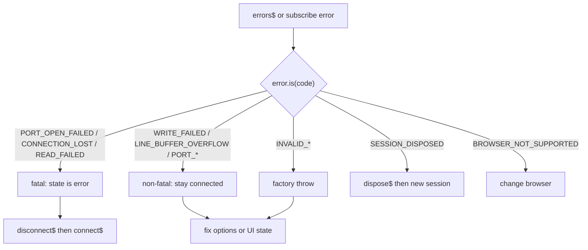

# Troubleshooting

Common Web Serial and `@gurezo/web-serial-rxjs` problems, with check steps and fixes. Start with [Quick Start](./quick-start.md) requirements if you have not connected yet. For error code tables, see [API concepts and design notes](./concepts.md#serialerror-serialerrorcode). For recommended next actions after an error, see the [Error Recovery Matrix](#error-recovery-matrix).

## Port picker does not open / device missing

**Symptoms:** Clicking Connect does nothing, or the browser dialog opens but your device is not listed.

**Check:**

1. Call `connect$()` from a **user gesture** (button click). The browser blocks the picker otherwise — see [Quick Start – Requirements](./quick-start.md#requirements).
2. Confirm the page is a [secure context](#secure-context-https--localhost) (HTTPS or localhost).
3. Confirm Web Serial is available — see [Web Serial API not available](#web-serial-api-not-available).
4. Try another USB cable / port, and close other apps that might hold the serial device (Arduino IDE, screen, minicom, another browser tab).
5. On the OS, confirm the device appears and drivers are installed.

**Fix:** Wire Connect to a click handler, fix secure context / browser support, free the port, then call `connect$()` again and subscribe.

## Web Serial API not available

**Symptoms:** `state$` stays at `unsupported`, or `connect$` fails with `SerialErrorCode.BROWSER_NOT_SUPPORTED`.

**Check:**

```typescript
import { isWebSerialSupported } from '@gurezo/web-serial-rxjs';

if (!isWebSerialSupported()) {
  console.error('Web Serial API is not available in this browser');
}
```

**Fix:** Use an officially supported desktop browser with Web Serial (Chrome 89+, Edge 89+, Opera 75+, Firefox 151+). **Safari** does not currently implement the Web Serial API. **Mobile** browsers are untested and out of official support — many also lack the API (so `isWebSerialSupported()` is `false`). See [Browser support and support policy](./browser-support.md), the [Examples requirements](https://gurezo.net/web-serial-rxjs/examples/), and the repository README.

## Secure context (HTTPS / localhost)

**Symptoms:** `navigator.serial` is missing, or Examples show an insecure-context message.

**Check:** The origin must be HTTPS or `http://localhost` / `http://127.0.0.1`. Plain `http://` on a LAN IP or hostname will not expose Web Serial.

**Fix:** Serve over HTTPS, use localhost for local development, or tunnel with a tool that terminates TLS. Details: [Quick Start – Requirements](./quick-start.md#requirements).

## Forgot to subscribe

**Symptoms:** Nothing happens after calling `connect$()`, `send$()`, `disconnect$()`, or `dispose$()` — no dialog, no send, no teardown.

**Check:** These methods return **cold** Observables. They only run when you **subscribe**.

```typescript
// Does nothing until subscribed
session.connect$();

// Runs the connection flow
session.connect$().subscribe({
  error: (e) => console.error(e),
});
```

**Fix:** Always subscribe (or use an operator that subscribes, such as converting to a Promise carefully). The same rule applies to `send$`, `disconnect$`, and `dispose$`. See [Quick Start – Running imperative methods (cold Observables)](./quick-start.md#running-imperative-methods-cold-observables).

## Line ending mismatch

**Symptoms:** Sends appear ignored, replies never arrive on `lines$`, or the terminal looks broken.

**Check:**

1. Many shells expect `\r\n` on send. Prefer `session.send$(`${line}\r\n`)` or a small `sendLine` helper — see [Advanced Usage – Send line](./advanced-usage.md#send-line-pattern).
2. Prefer **`lines$`** for newline-delimited logs/parsers. Prefer **`receive$`** (or `terminalText$`) for terminal-style `\r` redraw.
3. Interactive Examples expose a line-ending control; match it to your device.

**Fix:** Align send endings with the device, and pick `lines$` vs `receive$` for the consumer. Recipes: [Advanced Usage – Line framing](./advanced-usage.md#line-framing-built-in-vs-custom-framing-on-).

## Port already in use (conflict)

**Symptoms:** Picker shows the device but open fails, or `PORT_OPEN_FAILED` / related errors appear on `errors$`.

**Check:** Another process or browser tab may hold the port. Only one opener can own a serial port at a time on most OSes.

**Fix:** Close other serial tools and tabs, unplug/replug if needed, then connect again from a user gesture. Inspect `errors$` — see [Inspecting SerialError](#inspecting-serialerror).

## Reconnect fails

**Symptoms:** After disconnect or an error, Connect does nothing useful, or you get `SESSION_DISPOSED` / `PORT_ALREADY_OPEN`.

**Check:**

1. After **`disconnect$`**, the same session is reusable from `'idle'` (or recovered from `'error'`). Subscribe to `disconnect$`, wait for idle on `state$`, then `connect$()` again.
2. After **`dispose$`**, the session is permanent. Create a **new** `createSerialSession()` — do not reuse the disposed instance.
3. Do not call `connect$` while already `'connecting'` or `'connected'` (`PORT_ALREADY_OPEN`).

**Fix:** Drive UI from `state$`. For baud-rate changes or full teardown, `dispose$` then create a new session. See [Quick Start – Disconnect / Dispose](./quick-start.md#disconnect), [Framework session lifecycle](./framework-session-lifecycle.md), and [Advanced Usage – recovery](./advanced-usage.md).

## Inspecting SerialError

**Symptoms:** Failures are hard to classify from `Error.message` alone.

**Check:** Subscribe to **`errors$`** and narrow with `error.is(SerialErrorCode.*)`. For cause-bearing codes, read **`error.context.cause`**.

```typescript
import { SerialErrorCode } from '@gurezo/web-serial-rxjs';

session.errors$.subscribe((error) => {
  if (error.is(SerialErrorCode.OPERATION_CANCELLED)) {
    console.info('User cancelled the port picker');
    return;
  }
  if (error.is(SerialErrorCode.READ_FAILED)) {
    console.error('Read failed:', error.context.cause);
    return;
  }
  console.error(error.code, error.message, error.context);
});
```

Also handle `error` on `connect$().subscribe({ error })` and `send$().subscribe({ error })` — the same `SerialError` is multiplexed on `errors$`.

**Fix:** Branch on codes; full tables live in [SerialError / SerialErrorCode](./concepts.md#serialerror-serialerrorcode). Use the [Error Recovery Matrix](#error-recovery-matrix) below to decide the next action.

## Error Recovery Matrix

Parent: [#585](https://github.com/gurezo/web-serial-rxjs/issues/585) · Issue: [#594](https://github.com/gurezo/web-serial-rxjs/issues/594) · Related: [SerialError / SerialErrorCode](./concepts.md#serialerror-serialerrorcode) · [Timeout, cancel, and retry](./timeout-cancel-retry.md) · [Advanced Usage – Reconnect on fatal error](./advanced-usage.md#reconnect-on-fatal-error) · [Framework session lifecycle](./framework-session-lifecycle.md)

`errors$` (and `subscribe({ error })` on cold methods) tells you **what** failed. This matrix tells you **what to do next**: stay connected, reconnect the same session, or dispose and create a new one.

The library does **not** auto-reconnect. App-side retry policies belong in your RxJS composition — see [Timeout, cancel, and retry](./timeout-cancel-retry.md).

### How to decide

1. Narrow with `error.is(SerialErrorCode.*)` (or catch factory throws for `INVALID_*`).
2. Check **Severity**: fatal errors move `state$` to `'error'` and tear down the port / read pump; non-fatal errors leave the session connected.
3. Follow **Reconnect** / **Dispose** columns — do not call `connect$` on a disposed instance.



### Matrix

| Error | Severity | Recoverable | Recommended action | Reconnect (same session) | Dispose + new session |
| --- | --- | --- | --- | --- | --- |
| `BROWSER_NOT_SUPPORTED` | non-fatal | no | Switch to a supported Chromium / Firefox desktop browser. | no | optional (UI teardown) |
| `PORT_OPEN_FAILED` | fatal | yes | Free the port (other apps/tabs), check cable / permissions, then connect again. | yes | only if you abandon this session |
| `PORT_ALREADY_OPEN` | non-fatal | yes | Wait for `'idle'` / `'error'`, or `disconnect$` first, then `connect$`. | after disconnect | no |
| `PORT_NOT_OPEN` | non-fatal | yes | Call `connect$` before `send$` / `disconnect$`. | n/a (connect first) | no |
| `READ_FAILED` | fatal | yes | Check cable / device / drivers, then reconnect. | yes | if reconnect keeps failing |
| `WRITE_FAILED` | non-fatal | yes | Inspect `state$` and `context.cause`; resend if still `'connected'`. | only if connection also drops | no |
| `CONNECTION_LOST` | fatal | yes | Check cable / device, then reconnect. | yes | if you change baud rate or abandon session |
| `OPERATION_CANCELLED` | fatal | yes (manual) | User closed the picker — optional: offer Connect again. Do not auto-retry. | yes (user gesture) | no |
| `LINE_BUFFER_OVERFLOW` | non-fatal | yes | Raise `lineBuffer.maxChars`, ensure device line endings, or parse on `receive$`. Session stays connected. | no (not needed) | no |
| `SESSION_DISPOSED` | fatal | no | Instance is dead — create a new `createSerialSession()`. | no | already disposed; create new |
| `UNKNOWN` | fatal | maybe | Inspect `context.cause`. Prefer reconnect; if unclear, dispose and create a new session. | try first | if cause is unclear |
| `INVALID_FILTER_OPTIONS` | throw (factory) | yes | Fix `filters` and call `createSerialSession()` again. | n/a | recreate with fixed options |
| `INVALID_TERMINAL_BUFFER_OPTIONS` | throw (factory) | yes | Fix `terminalBuffer` and recreate the session. | n/a | recreate with fixed options |
| `INVALID_LINE_BUFFER_OPTIONS` | throw (factory) | yes | Fix `lineBuffer` and recreate the session. | n/a | recreate with fixed options |
| `INVALID_CONNECTION_OPTIONS` | throw (factory) | yes | Fix connection options (e.g. `baudRate`) and recreate the session. | n/a | recreate with fixed options |
| `PORT_NOT_AVAILABLE` | reserved | n/a | **Not emitted in v4.** Handle acquisition failures as `PORT_OPEN_FAILED` / `OPERATION_CANCELLED`. | — | — |
| `OPERATION_TIMEOUT` | reserved | n/a | **Not emitted in v4.** No core timeout API yet; compose timeouts in the app. | — | — |

### Column notes

- **Severity `fatal`**: session reports via `reportError`, moves toward `'error'`, and tears down the live port / read pump. Recover with `disconnect$` (if needed) then `connect$` on the **same** instance unless Dispose says otherwise.
- **Severity `non-fatal`**: multiplexed on `errors$` only; connection continues unless you choose to disconnect.
- **Severity `throw (factory)`**: raised synchronously from `createSerialSession()` — not delivered on `errors$`.
- **Severity `reserved`**: still present on the `SerialErrorCode` object but unreachable at runtime in v4.
- After **`dispose$`**, never reuse the instance — always create a new session ([Framework session lifecycle](./framework-session-lifecycle.md)).

## What to include when reporting

If you still cannot resolve the issue, open a [GitHub Discussion](https://github.com/gurezo/web-serial-rxjs/discussions) for usage questions, or a bug report via the [English](https://github.com/gurezo/web-serial-rxjs/issues/new?template=bug_report.yml) / [Japanese](https://github.com/gurezo/web-serial-rxjs/issues/new?template=bug_report.ja.yml) issue forms.

Please include:

- Browser name and version, OS
- Whether the page is HTTPS or localhost
- `@gurezo/web-serial-rxjs` and `rxjs` versions
- `SerialSessionStatus` / `SerialErrorCode` (and `context` if present)
- Minimal steps or a short code snippet (omit secrets / proprietary firmware dumps)

## Related links

- [Browser support and support policy](./browser-support.md) — API availability vs official support
- [Communication pattern Recipes](./recipes.md) — pattern → Guide index for line protocols, request/response, timeout
- [Quick Start](./quick-start.md)
- [API concepts and design notes](./concepts.md)
- [Error Recovery Matrix](#error-recovery-matrix) — per-code reconnect / dispose guidance
- [Advanced Usage](./advanced-usage.md)
- [English Guide index](./README.md) · [日本語 Guide 索引](../ja/README.md)
- [Documentation home](https://gurezo.net/web-serial-rxjs/)
- [Examples](https://gurezo.net/web-serial-rxjs/examples/)
