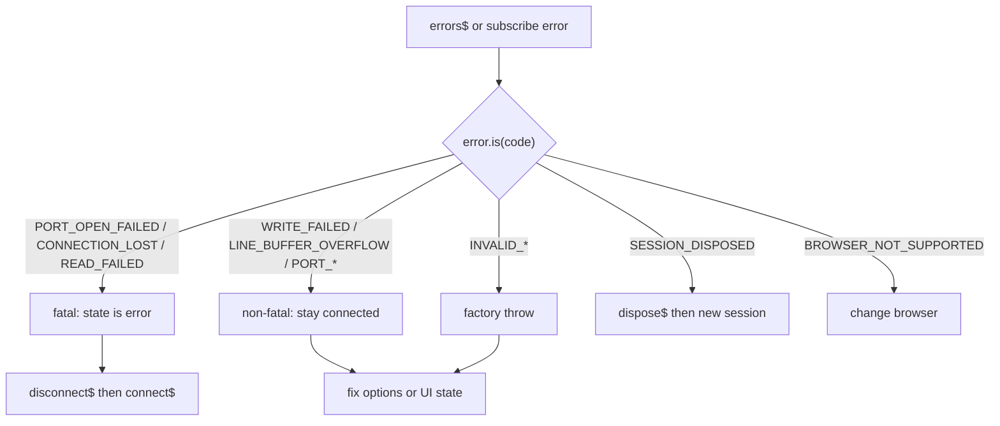

# トラブルシューティング

Web Serial および `@gurezo/web-serial-rxjs` でよくある問題の確認手順と対処です。まだ接続できていない場合は先に [クイックスタート](./quick-start.md) の利用条件を確認してください。エラーコード一覧は [概念と設計メモ](./concepts.md#serialerror-serialerrorcode) を参照してください。エラー発生後の推奨操作は [エラー Recovery Matrix](#エラー-recovery-matrix) を参照してください。

## ポート選択ダイアログが開かない / デバイスが表示されない

**症状:** 接続ボタンを押しても何も起きない、またはダイアログは開くがデバイスが一覧に出ない。

**確認:**

1. **`connect$()`** を **ユーザー操作**（ボタンクリックなど）から呼び出しているか。そうでないとブラウザはダイアログを開きません — [クイックスタート – 利用条件](./quick-start.md#利用条件)。
2. ページが [セキュアコンテキスト](#セキュアコンテキストhttps--localhost)（HTTPS または localhost）か。
3. Web Serial が使えるか — [Web Serial API が利用できない](#web-serial-api-が利用できない)。
4. 別の USB ケーブル / ポートを試し、Arduino IDE・screen・minicom・別タブなどポートを掴んでいるアプリを閉じる。
5. OS 上でデバイスが見え、ドライバが入っているか。

**対処:** クリックハンドラから接続し、セキュアコンテキスト / ブラウザ対応を直し、ポートを解放してから再度 `connect$()` を購読してください。

## Web Serial API が利用できない

**症状:** `state$` が `unsupported` のまま、または `connect$` が `SerialErrorCode.BROWSER_NOT_SUPPORTED` で失敗する。

**確認:**

```typescript
import { isWebSerialSupported } from '@gurezo/web-serial-rxjs';

if (!isWebSerialSupported()) {
  console.error('このブラウザでは Web Serial API を利用できません');
}
```

**対処:** 公式サポート対象のデスクトップブラウザ（Chrome 89+、Edge 89+、Opera 75+、Firefox 151+）を使ってください。**Safari** は現時点で Web Serial API を**実装していません**。**モバイル**ブラウザは未検証・公式サポート対象外であり、多くの環境では API 自体が無く `isWebSerialSupported()` が `false` になります。[ブラウザサポートと公式サポート方針](./browser-support.md)、[Examples の利用条件](https://gurezo.net/web-serial-rxjs/examples/)、リポジトリ README も参照してください。

## セキュアコンテキスト（HTTPS / localhost）

**症状:** `navigator.serial` が無い、または Examples で insecure-context と表示される。

**確認:** オリジンは HTTPS、または `http://localhost` / `http://127.0.0.1` である必要があります。LAN IP やホスト名の平文 `http://` では Web Serial は露出しません。

**対処:** HTTPS で配信する、ローカル開発は localhost を使う、または TLS 終端付きのトンネルを使う。詳細: [クイックスタート – 利用条件](./quick-start.md#利用条件)。

## subscribe 漏れ

**症状:** `connect$()` / `send$()` / `disconnect$()` / `dispose$()` を呼んでもダイアログも送信も破棄も起きない。

**確認:** これらのメソッドは **cold** な Observable を返します。**購読（subscribe）したときだけ**実行されます。

```typescript
// 購読しない限り何も起きない
session.connect$();

// 接続フローが走る
session.connect$().subscribe({
  error: (e) => console.error(e),
});
```

**対処:** 必ず購読してください（Promise 化する場合も購読が発生する形にする）。`send$` / `disconnect$` / `dispose$` も同様です。[クイックスタート – 命令メソッドの実行（cold Observable）](./quick-start.md#命令メソッドの実行cold-observable) を参照。

## 改行コード不一致

**症状:** 送信が無視されたように見える、`lines$` に応答が来ない、ターミナル表示が崩れる。

**確認:**

1. 多くのシェルは送信側に `\r\n` を期待します。`session.send$(`${line}\r\n`)` や小さな `sendLine` ヘルパーを使う — [高度な使用方法 – 行送信](./advanced-usage.md)。
2. 改行区切りのログ / パーサには **`lines$`**。`\r` による上書きを含むターミナル表示には **`receive$`**（または `terminalText$`）。
3. 対話 Examples の改行コード選択をデバイスに合わせる。

**対処:** 送信改行をデバイスに合わせ、受信は用途に応じて `lines$` / `receive$` を選ぶ。レシピ: [高度な使用方法 – 行フレーミング](./advanced-usage.md)。

## ポート競合

**症状:** 一覧には出るが open に失敗する、または `PORT_OPEN_FAILED` などが `errors$` に出る。

**確認:** 別プロセスや別タブがポートを掴んでいる可能性があります。多くの OS では同時に 1 つの opener しか所有できません。

**対処:** 他のシリアルツールやタブを閉じ、必要なら抜き差ししてからユーザー操作で再接続する。`errors$` を確認 — [SerialError の確認](#serialerror-の確認)。

## 再接続に失敗する

**症状:** 切断やエラーのあと接続できず、`SESSION_DISPOSED` や `PORT_ALREADY_OPEN` になる。

**確認:**

1. **`disconnect$`** 後は同一セッションを `'idle'`（または `'error'` からの回復後）から再利用できます。`disconnect$` を購読し、`state$` で idle を待ってから再度 `connect$()`。
2. **`dispose$`** 後はセッションは永久破棄です。**新しい** `createSerialSession()` を作り、破棄済みインスタンスは使わない。
3. すでに `'connecting'` / `'connected'` のときに `connect$` を呼ぶと `PORT_ALREADY_OPEN` になります。

**対処:** UI は `state$` から駆動する。baud rate 変更や完全破棄では `dispose$` のあと新規 session を作る。[クイックスタート – 切断 / 破棄](./quick-start.md#切断する)、[Framework 別 session ライフサイクル](./framework-session-lifecycle.md)、[高度な使用方法](./advanced-usage.md) を参照。

## SerialError の確認

**症状:** `Error.message` だけでは失敗の種類が分からない。

**確認:** **`errors$`** を購読し、`error.is(SerialErrorCode.*)` で narrowing する。cause 付きコードは **`error.context.cause`** を読む。

```typescript
import { SerialErrorCode } from '@gurezo/web-serial-rxjs';

session.errors$.subscribe((error) => {
  if (error.is(SerialErrorCode.OPERATION_CANCELLED)) {
    console.info('ポート選択がキャンセルされました');
    return;
  }
  if (error.is(SerialErrorCode.READ_FAILED)) {
    console.error('読み取り失敗:', error.context.cause);
    return;
  }
  console.error(error.code, error.message, error.context);
});
```

`connect$().subscribe({ error })` や `send$().subscribe({ error })` の `error` も扱い、同じ `SerialError` が `errors$` に多重配信されます。

**対処:** コードで分岐する。一覧は [SerialError / SerialErrorCode](./concepts.md#serialerror-serialerrorcode)。次の操作は下記 [エラー Recovery Matrix](#エラー-recovery-matrix) を参照してください。

## エラー Recovery Matrix

Parent: [#585](https://github.com/gurezo/web-serial-rxjs/issues/585) · Issue: [#594](https://github.com/gurezo/web-serial-rxjs/issues/594) · Related: [SerialError / SerialErrorCode](./concepts.md#serialerror-serialerrorcode) · [タイムアウト・キャンセル・再試行](./timeout-cancel-retry.md) · [高度な使用方法 – 致命的エラー時の再接続](./advanced-usage.md#致命的エラー時の再接続) · [Framework 別 session ライフサイクル](./framework-session-lifecycle.md)

`errors$`（および cold メソッドの `subscribe({ error })`）は**何が**失敗したかを示します。この Matrix は**次に何をすべきか**（接続維持 / 同一 session で再接続 / dispose して新規作成）を示します。

ライブラリは**自動再接続しません**。アプリ側の再試行ポリシーは RxJS の合成で実装してください — [タイムアウト・キャンセル・再試行](./timeout-cancel-retry.md) を参照。

### 判断の進め方

1. `error.is(SerialErrorCode.*)` で narrow する（`INVALID_*` は factory の throw を catch）。
2. **Severity** を確認する: fatal は `state$` を `'error'` にし port / read pump を teardown する。non-fatal は接続を維持する。
3. **Reconnect** / **Dispose** 列に従う — dispose 済みインスタンスで `connect$` を呼ばない。



### Matrix

| Error | Severity | Recoverable | 推奨対応 | Reconnect（同一 session） | Dispose + 新規 session |
| --- | --- | --- | --- | --- | --- |
| `BROWSER_NOT_SUPPORTED` | non-fatal | no | 対応デスクトップブラウザ（Chromium / Firefox）へ変更する | no | 任意（UI teardown） |
| `PORT_OPEN_FAILED` | fatal | yes | 他アプリ／タブを閉じ、ケーブル／権限を確認して再接続する | yes | この session を捨てる場合のみ |
| `PORT_ALREADY_OPEN` | non-fatal | yes | `'idle'` / `'error'` を待つか、先に `disconnect$` してから `connect$` | disconnect 後 | no |
| `PORT_NOT_OPEN` | non-fatal | yes | `send$` / `disconnect$` の前に `connect$` する | n/a（先に connect） | no |
| `READ_FAILED` | fatal | yes | ケーブル／デバイス／ドライバを確認して再接続する | yes | 再接続が続けて失敗する場合 |
| `WRITE_FAILED` | non-fatal | yes | `state$` と `context.cause` を確認し、`'connected'` なら再送可否を判断する | 接続も落ちた場合のみ | no |
| `CONNECTION_LOST` | fatal | yes | ケーブル／デバイスを確認して再接続する | yes | baud 変更や session 放棄時 |
| `OPERATION_CANCELLED` | fatal | yes（手動） | ユーザーが picker を閉じた — 任意で再度 Connect。自動 retry しない | yes（ユーザー操作） | no |
| `LINE_BUFFER_OVERFLOW` | non-fatal | yes | `lineBuffer.maxChars` を上げる、改行を確認する、または `receive$` で扱う。切断不要 | no（不要） | no |
| `SESSION_DISPOSED` | fatal | no | インスタンスは終端 — 新しい `createSerialSession()` を作る | no | 既に dispose 済み。新規作成 |
| `UNKNOWN` | fatal | maybe | `context.cause` を確認。まず再接続を試し、不明なら dispose + 新規 session | まず試す | 原因不明のとき |
| `INVALID_FILTER_OPTIONS` | throw（factory） | yes | `filters` を直して `createSerialSession()` し直す | n/a | 修正後に再生成 |
| `INVALID_TERMINAL_BUFFER_OPTIONS` | throw（factory） | yes | `terminalBuffer` を直して session を再生成する | n/a | 修正後に再生成 |
| `INVALID_LINE_BUFFER_OPTIONS` | throw（factory） | yes | `lineBuffer` を直して session を再生成する | n/a | 修正後に再生成 |
| `INVALID_CONNECTION_OPTIONS` | throw（factory） | yes | 接続オプション（例: `baudRate`）を直して再生成する | n/a | 修正後に再生成 |
| `PORT_NOT_AVAILABLE` | reserved | n/a | **v4 では emit されない。** 取得失敗は `PORT_OPEN_FAILED` / `OPERATION_CANCELLED` で扱う | — | — |
| `OPERATION_TIMEOUT` | reserved | n/a | **v4 では emit されない。** コアの timeout API は未実装。アプリ側で合成する | — | — |

### 列の注記

- **Severity `fatal`**: `reportError` 経由で `'error'` 側へ進み、ライブな port / read pump を teardown する。Dispose 列で別指定がなければ、**同一**インスタンスで `disconnect$`（必要なら）→ `connect$` で回復する。
- **Severity `non-fatal`**: `errors$` にのみ多重配信。切断しない限り接続は続く。
- **Severity `throw（factory）`**: `createSerialSession()` から同期的に投げられる — `errors$` には流れない。
- **Severity `reserved`**: `SerialErrorCode` オブジェクトには残るが、v4 実行時には到達しない。
- **`dispose$` 後**はインスタンスを再利用しない — 必ず新規 session を作る（[Framework 別 session ライフサイクル](./framework-session-lifecycle.md)）。

## 報告時に必要な情報

解決できない場合は、使い方の質問は [GitHub Discussions](https://github.com/gurezo/web-serial-rxjs/discussions)、バグは [日本語](https://github.com/gurezo/web-serial-rxjs/issues/new?template=bug_report.ja.yml) / [英語](https://github.com/gurezo/web-serial-rxjs/issues/new?template=bug_report.yml) の Issue フォームへ。

次を含めてください。

- ブラウザ名・バージョン、OS
- ページが HTTPS か localhost か
- `@gurezo/web-serial-rxjs` と `rxjs` のバージョン
- `SerialSessionStatus` / `SerialErrorCode`（あれば `context`）
- 再現手順または短いコード片（秘密情報や専用ファームのダンプは除く）

## 関連リンク

- [ブラウザサポートと公式サポート方針](./browser-support.md) — API 実装状況と公式サポートの区別
- [通信パターン別 Recipes](./recipes.md) — 行プロトコル、コマンド／応答、タイムアウトなどの索引
- [クイックスタート](./quick-start.md)
- [概念と設計メモ](./concepts.md)
- [エラー Recovery Matrix](#エラー-recovery-matrix) — コード別の再接続 / dispose 指針
- [高度な使用方法](./advanced-usage.md)
- [日本語 Guide 索引](./README.md) · [English Guide index](../en/README.md)
- [ドキュメントホーム](https://gurezo.net/web-serial-rxjs/)
- [Examples](https://gurezo.net/web-serial-rxjs/examples/)
